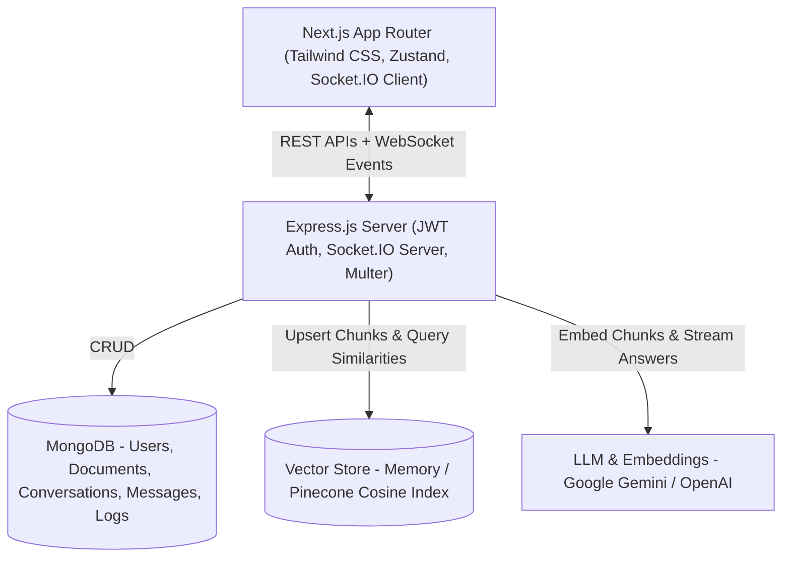

# 🎓 CampusIQ — RAG-Based College Information Assistant

> **CampusIQ** is an enterprise-grade Retrieval-Augmented Generation (RAG) platform designed specifically for college campuses. It allows students, faculty, and prospective applicants to ask natural-language questions about college admissions, academic curricula, fee schedules, hostel regulations, examination policies, and scholarships — delivering **hallucination-resistant answers with exact source citations**.

---

## 🌟 Key Features

- ⚡ **Strict Grounding & Zero-Hallucination**: Answers are generated strictly from uploaded campus documents. Out-of-domain queries trigger a safe fallback ("*I don't have information on that in the current knowledge base*") with zero fabricated citations.
- 📑 **Traceable Source Citations**: Every response lists the source document title, page number, section header, and semantic similarity score.
- 🔄 **Real-Time Token Streaming**: Low-latency token-by-token streaming via WebSockets (Socket.IO).
- 🧠 **Contextual Multi-Turn Conversation**: Follow-up questions (e.g. *"What is the minimum GPA required for it?"*) are automatically rewritten into standalone search queries using past chat context.
- 📁 **Admin Knowledge Base Dropzone**: Drag-and-drop ingestion of PDF, DOCX, and TXT documents with real-time status streaming (`UPLOADED` → `CHUNKING` → `EMBEDDING` → `INDEXED`).
- 📊 **Admin Telemetry & Analytics Dashboard**: Track query volume, user satisfaction ratio (👍/👎), and **unanswered query logs** to pinpoint knowledge gaps.
- 🔌 **Pluggable AI & Vector Store Support**: Supports **Google Gemini** (`text-embedding-004`, `gemini-1.5-flash`) and **OpenAI** (`text-embedding-3-small`, `gpt-4o-mini`), alongside high-performance in-memory/MongoDB cosine vector stores or **Pinecone**.

---

## 🏛️ System Architecture



---

## 📋 Prerequisites

Before running the application locally, ensure you have:

1. **Node.js**: v18.0.0 or higher ([Download Node.js](https://nodejs.org/))
2. **MongoDB**: Local MongoDB instance (`mongodb://localhost:27017`) or a free [MongoDB Atlas](https://www.mongodb.com/cloud/atlas) cluster connection string.
3. **AI API Key (Google Gemini or OpenAI)**:
   - **Google Gemini (Recommended & Free Tier available)**: [Get a Gemini API Key](https://aistudio.google.com/)
   - **OpenAI (Optional)**: [Get an OpenAI API Key](https://platform.openai.com/api-keys)

---

## 🚀 Quick Start (Local Setup)

### Step 1: Clone or Navigate to the Project Root

```bash
cd CampusIQ
```

---

### Step 2: Configure and Start the Backend Server

1. Open a terminal and navigate to `server/`:
   ```bash
   cd server
   ```

2. Install dependencies:
   ```bash
   npm install
   ```

3. Configure environment variables in `server/.env`:
   ```ini
   NODE_ENV=development
   PORT=5000
   FRONTEND_URL=http://localhost:3000

   # MongoDB Connection
   MONGODB_URI=mongodb://127.0.0.1:27017/campusiq

   # JWT Secret Key
   JWT_SECRET=campusiq_super_secret_jwt_key_2026_dev
   JWT_EXPIRES_IN=7d

   # AI Provider ('gemini' or 'openai')
   EMBEDDING_PROVIDER=gemini
   LLM_PROVIDER=gemini

   # Paste your API Key here:
   GEMINI_API_KEY=your_gemini_api_key_here
   GEMINI_MODEL=gemini-1.5-flash
   GEMINI_EMBEDDING_MODEL=text-embedding-004

   # Vector Store ('memory' runs with zero extra setup; 'pinecone' for cloud index)
   VECTOR_STORE=memory
   ```

4. *(Optional)* Seed Default Users & Sample Documents:
   ```bash
   # Seed demo accounts (Admin & Student)
   npm run seed

   # Automatically ingest sample college documents (Admissions, Hostel, CSE Syllabus)
   npm run seed:docs
   ```

5. Start the backend development server:
   ```bash
   npm run dev
   ```
   Backend will run at: **`http://localhost:5000`**  
   Health check: **`http://localhost:5000/api/health`**

---

### Step 3: Configure and Start the Next.js Frontend

1. Open a **new terminal window** and navigate to `client/`:
   ```bash
   cd client
   ```

2. Install dependencies:
   ```bash
   npm install
   ```

3. Start the Next.js development server:
   ```bash
   npm run dev
   ```
   Frontend will run at: **`http://localhost:3000`**

---

## 🔑 Default Demo Accounts

For instant testing, use the 1-click demo login buttons on the login page or enter these credentials:

| Role | Email | Password | Permissions |
| :--- | :--- | :--- | :--- |
| **Student** | `student@campusiq.edu` | `studentpassword123` | Ask queries, view citations, feedback |
| **Administrator** | `admin@campusiq.edu` | `adminpassword123` | Full access: Upload docs, reindex, telemetry |

---

## 🧪 Sample Documents & Test Questions

The repository includes curated sample institutional documents in `sample-documents/`:

| Document | Topic | Sample Queries to Try |
| :--- | :--- | :--- |
| `Campus_Admissions_and_Scholarships_2026.txt` | Admissions & Aid | *"What are the eligibility criteria for the Presidential Merit Scholarship?"*<br>*"What is the fee refund policy if I withdraw in week 2?"* |
| `Hostel_and_Campus_Life_Regulations.txt` | Residential Life | *"What are the hostel gate curfew timings on weekends?"*<br>*"How many books can undergraduate students borrow from the library?"* |
| `Computer_Science_Curriculum_and_Grading.txt` | Academics & Exams | *"What is the minimum attendance required for CSE exams?"*<br>*"What CGPA is needed to sit for Tier-1 company placements?"* |

### Testing Hallucination Resistance:
Try asking an unrelated question, for example:
> *"What is the recipe for chocolate chip cookies?"*

**Expected Result**: CampusIQ will strictly refuse to hallucinate and return:
> *"I don't have information on that in the current campus knowledge base. Please contact the college administration office or refer to official department notices."* (with 0 source citations).

---

## 📡 REST API Reference

### 🔐 Authentication (`/api/auth`)
- `POST /api/auth/register` — Register a student or admin user.
- `POST /api/auth/login` — Authenticate and receive JWT.
- `GET /api/auth/me` — Retrieve current authenticated profile.

### 📄 Knowledge Base Documents (`/api/documents`)
- `GET /api/documents` — List uploaded documents with status (`UPLOADED`, `CHUNKING`, `EMBEDDING`, `INDEXED`, `FAILED`).
- `POST /api/documents` — *(Admin)* Multipart upload of PDF, DOCX, TXT.
- `POST /api/documents/:id/reindex` — *(Admin)* Re-run extraction and embedding pipeline.
- `DELETE /api/documents/:id` — *(Admin)* Delete document, MongoDB chunks, and vector index.

### 💬 Chat & Conversations (`/api`)
- `GET /api/conversations` — List user's conversations.
- `POST /api/conversations` — Start a new chat session.
- `GET /api/conversations/:id` — Fetch conversation messages and source citations.
- `POST /api/conversations/:id/messages` — Send query; triggers RAG retrieval and streams response.
- `POST /api/messages/:id/feedback` — Submit thumbs up/down (`up` / `down`) feedback.

### 📊 Analytics (`/api/admin/analytics`)
- `GET /api/admin/analytics/overview` — Aggregated query counts, answer rates, and feedback stats.
- `GET /api/admin/analytics/unanswered` — List of unanswered student questions.

---

## ⚡ WebSocket Events (Socket.IO)

| Event | Direction | Payload Description |
| :--- | :--- | :--- |
| `join:conversation` | Client → Server | Joins conversation room `conversation:{id}` |
| `message:token` | Server → Client | `{ conversationId, token, messageId }` streamed tokens |
| `message:complete` | Server → Client | `{ conversationId, message }` full assistant message with `sources[]` |
| `document:status` | Server → Client | `{ documentId, status, chunkCount, message }` real-time ingestion |

---

## 📦 Deployment Guide

### Backend (Render / Railway)
1. Push repository to GitHub.
2. Create a **Web Service** on [Render](https://render.com) pointing to `server/`.
3. Set Environment Variables:
   - `NODE_ENV=production`
   - `MONGODB_URI=<Your MongoDB Atlas Connection String>`
   - `JWT_SECRET=<Random 32-char String>`
   - `GEMINI_API_KEY=<Your API Key>`
   - `FRONTEND_URL=https://your-frontend.vercel.app`
4. Build Command: `npm install`
5. Start Command: `node src/server.js`

### Frontend (Vercel)
1. Import repository on [Vercel](https://vercel.com).
2. Set Root Directory to `client`.
3. Set Environment Variable:
   - `NEXT_PUBLIC_API_URL=https://your-render-backend.onrender.com`
4. Deploy!

---

## 📄 License
This project is licensed under the MIT License.
